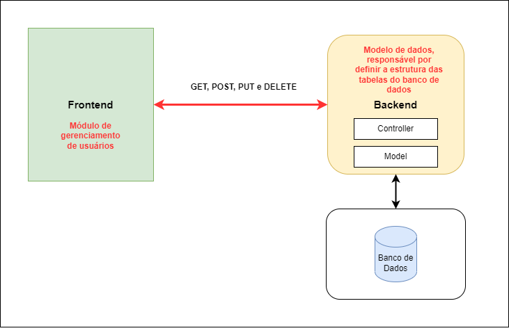

# Bemol-Desafio-Software-Engineer

# Introdução

Neste repositório estão os projetos de backend e frontend que foram desenvolvidos com Laravel e Angular. Para executar esses projetos, siga as instruções abaixo.

## Pré-requisitos

- PHP 8 ou superior
- Composer
- Node.js
- NPM
- Angular CLI
- MySQL

## Backend

### Configuração

1. Clone este repositório em sua máquina local.
2. Entre na pasta backend usando o terminal.
3. Execute o comando `composer install` para instalar as dependências.
4. Crie um banco de dados MySQL em sua máquina local.
5. Crie um arquivo `.env` na raiz do projeto e configure as variáveis de ambiente de acordo com o exemplo em `.env.example`.
6. Execute o comando `php artisan migrate` para criar as tabelas no banco de dados.
7. Execute o comando `php artisan serve` para iniciar o servidor de desenvolvimento.

### Execução

Após a configuração, o servidor estará disponível no endereço `http://localhost:8000`. Você pode testar as rotas da API usando ferramentas como o Postman ou o Insomnia.

## Frontend

### Configuração

1. Clone este repositório em sua máquina local.
2. Entre na pasta frontend usando o terminal.
3. Execute o comando `npm install` para instalar as dependências.
4. Execute o comando `ng serve` para iniciar o servidor de desenvolvimento.

### Execução

Após a configuração, o servidor estará disponível no endereço `http://localhost:4200`. Você pode acessar o frontend usando o seu navegador de preferência.

  

